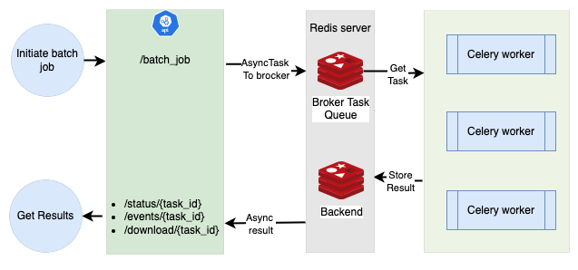

# LLM Judge backend

## Create environment

```sh
python3 -m venv backend
```

```sh
source backend/bin/activate
```

## Install requirement

```sh
pip3 install -r requirements.txt
```

## Run the server

```sh
python3 main.py
```

## Architecture diagram


